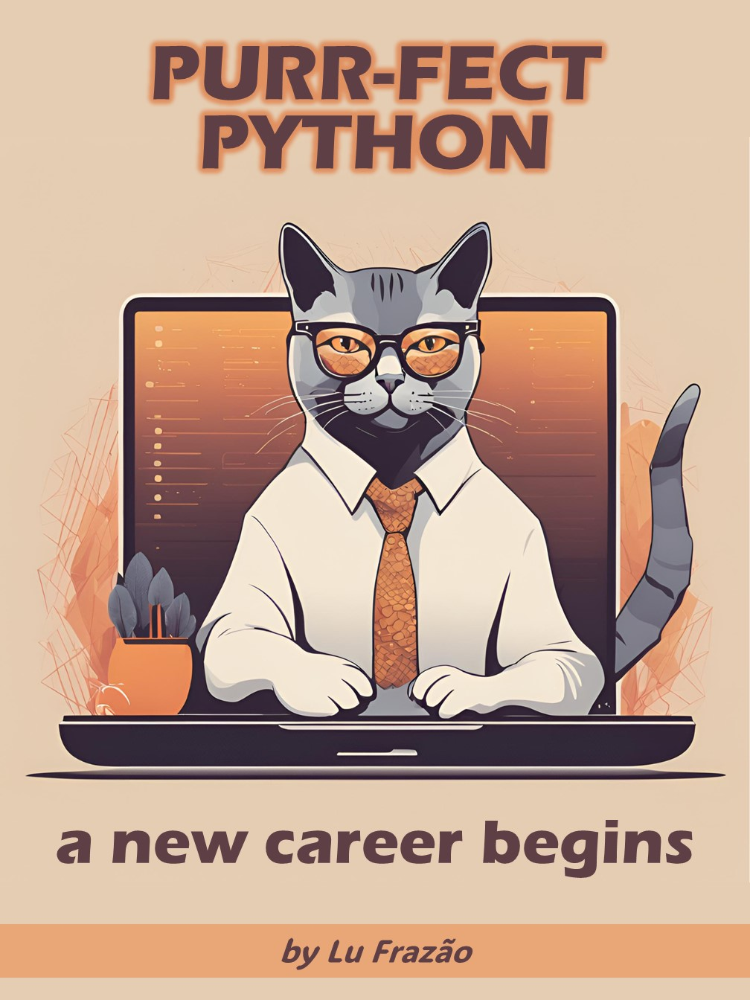

    

-------

# Projeto EBOOK Gerado por I.A.s

 > ℹ️ **NOTE:** Este é o repositório desenvolvido durante o curso no qual fui aluna na plataforma da [DIO](https://dio.me)

Projeto com o objetivo de gerar um eBook digital com as facilidades das ferramentas de IA. Todos os prompts
seguem abaixo.

<a href="https://github.com/lucianafrazao/prompts-recipe-to-create-a-ebook/blob/main/output/ebook%20-%20css%20jedi%20output.pdf" title="View PDF now"> 📕Clique aqui para ler</a>

## 💻 Tecnologias utilizadas no projeto

- [ChatGPT](https://chat.openai.com/) 
- [Canva](https://www.canva.com/)
- [PowerPoint](https://www.microsoft.com/en/microsoft-365/powerpoint)

## 🧠 Prompts

ChatGPT：

|   Ação   | prompt                                                                                                                                                                                                                                                                         |
| :------: | ------------------------------------------------------------------------------------------------------------------------------------------------------------------------------------------------------------------------------------------------------------------------------ |
|  título  | Create a title for an ebook on Python. The eBook is for the niche of beginner programmers looking for a career change. The title must be epic and short, and also cat themed. Suggest at least 5 titles.                                                        |
| conteúdo | Create a text for the ebook, focused on python for beginners, listing the most important commands with code examples. {RULES} > Explain in an easy and clear manner > Make the text short > Always show code examples based on real-life contexts > Always suggest a title for each section |

Canva：

|  Ação  | prompt                                                                                 |
| :----: | -------------------------------------------------------------------------------------- |
| imagem da capa | A sleek, modern design featuring a confident cat, sitting at a laptop. The background could be a subtle blend of soft, warm colors, perhaps with abstract geometric patterns to give it a tech-savvy vibe. |

## ✨ Features

- Conteúdo gerado via ChatGPT
- Imagens geradas via Canva

## 📚 Materiais

- Imagens utilizadas em `assets`
- ebook gerado durante as aulas em `output`

## 🛠️ Instruções de execução

Utilize os prompts acima nas ferramentas sugeridas para gerar o material base e utilize uma ferramenta de edição de documentos como power point, libreoffice, ou inDesign para diagramação.

## 👨‍💻 Made by

    
    
&nbsp&nbsp&nbspLu Frazão 
    &nbsp&nbsp&nbsp
    <a href="https://github.com/lucianafrazao">
    GitHub</a>&nbsp;|&nbsp;
    <a href="https://www.linkedin.com/in/lu-frazao-00000000l/">LinkedIn</a>
&nbsp;|&nbsp;
    <a href="https://www.instagram.com/lufrazao/">
    Instagram</a>
&nbsp;|&nbsp;

  

---

⌨️ com 💜 por [Lu Frazão](https://github.com/lucianafrazao)